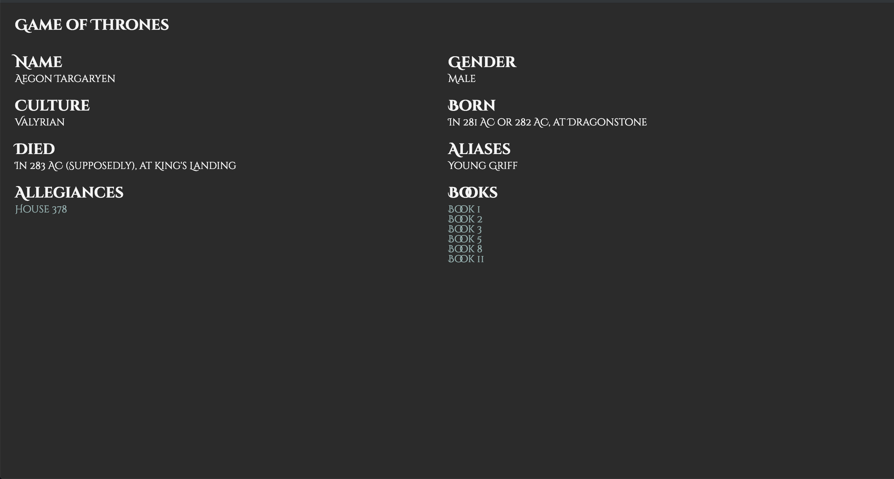

# Performance Matters

[🚀 Demo link 🚀](https://performance-matters.herokuapp.com/).

A Game of Thrones inspired **server side rendered** application which allows the user to explore relations between characters, houses, books and more. It aims to let users learn more about Game of Thrones.

Homepage | Detail page
:-------------------------:|:-------------------------:
 | 

## Table of Contents

1. [Installation](#Installation)
2. [Optimisations](#Optimisations)
    1. [Focus points](#Focus-points)
    2. [The good stuff](#The-good-stuff)
3. [Future enhancements](#Future-enhancements)
4. [Technologies used 📦](#Technologies-used)
5. [Data sources](#Data-sources)
6. [License](#License)

## Installation

* Make sure to install [yarn](https://yarnpkg.com/en/) or [npm](https://www.npmjs.com).
* Make sure the **port** specified in the [index.ts](server/src/index.ts) is available (defaults to 3000).

* Clone the repository: `git clone git@github.com:Maikxx/performance-matters-1819.git`.
* Navigate into the directory: `cd performance-matters-1819`.
* Install dependencies: `yarn` or `npm install`.
* Start the server with: `yarn start-server` or `npm run start-server`.

The build (`yarn build`) runs the TypeScript compiler first, turning the TypeScript files into JavaScript files in the `dist` folder.
The build process will then copy the `views` folder to the `dist` folder.

## Optimisations

### Focus points

* First view - When browsing around the web, the most annoying thing that can happen is when you are on a slow connection, and then the pages often takes up to 5 seconds to show any content (looking at you nu.nl).

* Repeat view - In this case, it is more convenient for the page to be quick. For example (again), nu.nl doesn't do this very well in my eyes. It seems as though they just made the mobile website crappy in order for you to download the bloated, data-mining, ad haven of an app. Anyways, rant over. I perceive it as shitty if you go to a page, click on a link and read something, then go back and are greeted with a white screen.

* Time to first byte - I just added this, because thought it was interesting to look at ways in which the server can respond in a very fast manner.

### The good stuff

* Enabled text [compression](https://github.com/expressjs/compression). This reduced the time to first byte as well as improving the speed at which the page is first shown.

* Render the application server side.

* [Minify and prefix](./server/gulpfile.js) the CSS. This reduced the time to first byte as well as improving the speed at which the page is first shown.

* [Minify and compile](./server/gulpfile.js) the client-side TypeScript. This reduced the time to first byte as well as improving the speed at which the page is first shown.

* Prefetch [data](./server/public/data) from the [API](https://anapioficeandfire.com/) on the server and load it into memory, so that no excess requests are needed, this however only works if you are sure that the data from the API will not change, which is the case in this API until a new season of GoT will arrive. This decreased the time to first byte drastically, since the server didn't need to perform a request to an API each time a view is asked to render.

* Added [meta description](./server/src/views/partials/head.ejs#L3) tag to increase SEO scrore.

* Added [robots.txt](./server/public/robots.txt) to increase SEO scrore.

* Add [memory caching](./server/src/services/memoryCache.ts). This decreased the time it takes for the repeat view to show to the user, since it is being served from the cache.

* Progressive enhancement for searching.

* Precompression. This reduced the time to first byte, because the server didn't need to compress files on the fly for each request, but instead is asked to compress them when changes happen to the files (JS and CSS in this case). This also increased the speed at which the first view is shown to the user.

* Make use of a web font, with WOFF and WOFF2, with only a subset of all characters (only Latin).

* Make use of a service worker to view visited pages offline.

After tweaking some more things with the service worker, the following is the final score when running audits:

As you can see in the image, there are just a few things that could be even more optimized where I did not have time for, which I put in the [future enhancements](#Future-enhancements) section below.

## Future enhancements

* Infinite scrolling to prevent enourmous amounts of DOM elements to be rendered at once.
* HTTP2.

## Technologies used

* [Concurrently](https://www.npmjs.com/package/concurrently).
* [Express](https://expressjs.com/).
* [Gulp](https://gulpjs.com/).
* [TypeScript](https://www.typescriptlang.org).
* [Wait-on](https://www.npmjs.com/package/wait-on).
* [Yarn](https://yarnpkg.com/en/).

## Data sources

* [APIOfFireAndIce](https://anapioficeandfire.com/)
    This is a Game of Thrones API providing a lot of information about Game of Thrones characters, books, houses and more.

    This API does not require authentication, but has got a few limits:
    * Rate limit of 20000 requests made per day, per IP-address.
    * 50 requests per page maximum.
    * Is not zero-based.

## License

This repository is licensed as [MIT](LICENSE) by [Maikel van Veen](https://github.com/maikxx).